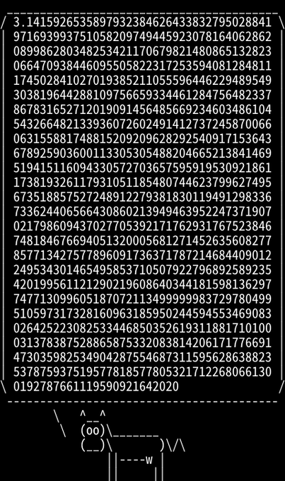
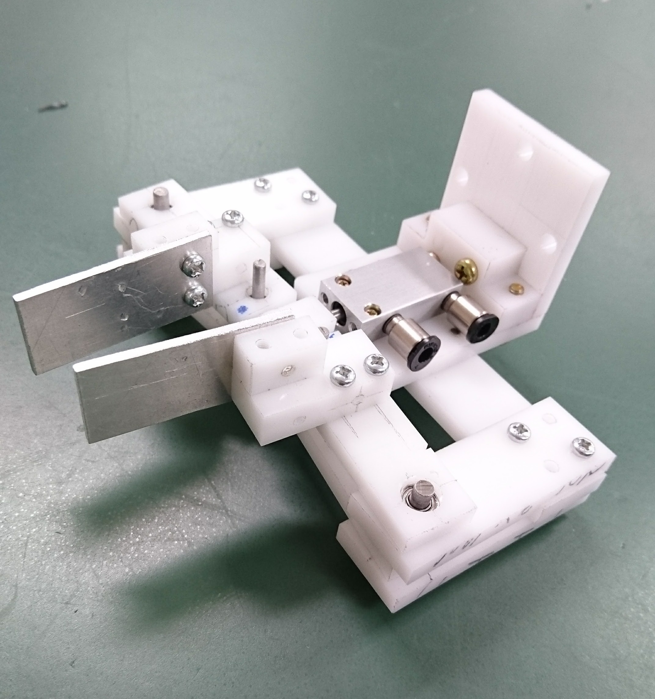
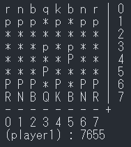
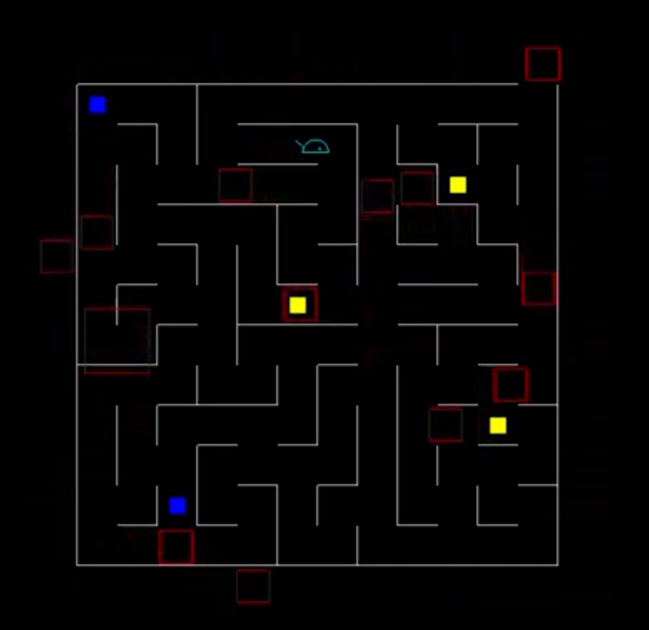

# Yusuke Kato Pages

https://YusukeKato.github.io

# About

- 名前：加藤祐介
- 大学：千葉工業大学（工学部）卒業
- 好きなもの：ロボット、ゲーム、小説など
- 趣味：小説執筆、競技プログラミングなど

# Links

- [GitHub : YusukeKato](https://github.com/YusukeKato)
- [Twitter : y_kato222](https://twitter.com/y_kato222)
- [YouTube : ykato](https://www.youtube.com/channel/UC4TaLIvjTNPjPys2AZjP3Rw)
- [HatenaBlog : YKpages](https://kato-robotics.hatenablog.com/)
- [Qiita : ykpages](https://qiita.com/ykpages)
- [カクヨム : yusuke_kato](https://kakuyomu.jp/users/yusuke_kato)
- [AtCoder : yusuke_kato](https://atcoder.jp/users/yusuke_kato)
- [競技プログラミングの痕跡](https://github.com/YusukeKato/ProgrammingContest)
- [日記](https://yusukekato.github.io/Diary/)

# Portfolio

## 2022

### 円周率シェル芸

- [シェル芸のトップページ](https://b.ueda.tech/?page=01434)
- [ツイートのリンク](https://twitter.com/y_kato222/status/1598610852621750272)

```sh
python -c "
from decimal import Decimal as D
from decimal import *
getcontext().prec=999
a=D(1)
b=D(1)/D(2).sqrt()
t=D(0.25)
p=D(1)
for i in range(999):
 e=(a+b)/D(2);f=(a*b).sqrt();g=t-p*(a-e)**2;h=D(2)*p;a=e;b=f;t=g;p=h
print((a+b)**2/(D(4)*t))" | cowsay | textimg -s
```



### 四角回転シェル芸

- [シェル芸のトップページ](https://b.ueda.tech/?page=01434)
- [ツイートのリンク](https://twitter.com/y_kato222/status/1598470274797948928)

```sh
convert -size 283x283 xc:#FF0000 b.png; for i in {0..8}; do convert -size 200x200 xc:#FF0000 -rotate -$((i*10)) i$i.png; convert b.png i$i.png -gravity northeast -composite o$i.png; done; convert -layers optimize -loop 0 -delay 10 /o*.png /images/a.gif
```


## 2016

### ロボットハンド

- 設計と加工の授業にて製作
- Inventorと加工機
- チェスの駒を把持



### チェス

- ターミナル上で遊べるチェス
- C言語
- [GitHub : ソースコード](https://github.com/YusukeKato/chess_robot)



## 2015

### 初めて作成したゲーム

- 青いネズミを操作して迷路から脱出
- C言語とOpenGLで作成
- [YouTube : 動画](https://youtu.be/X-wTG_04Z1w)


